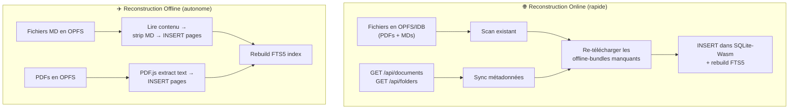
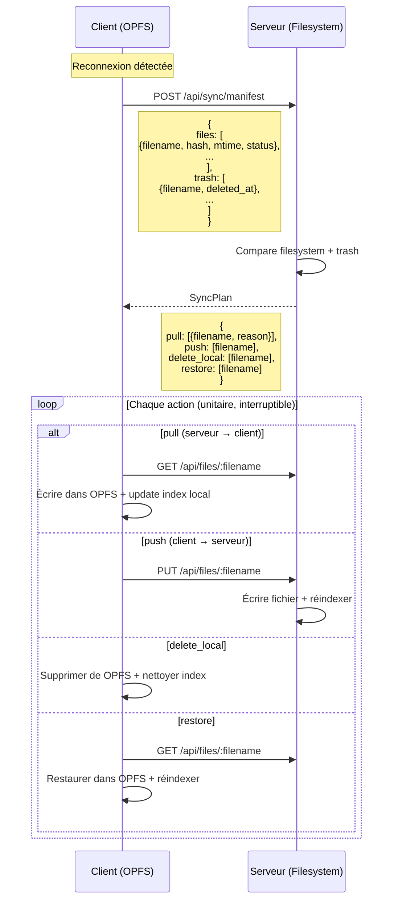
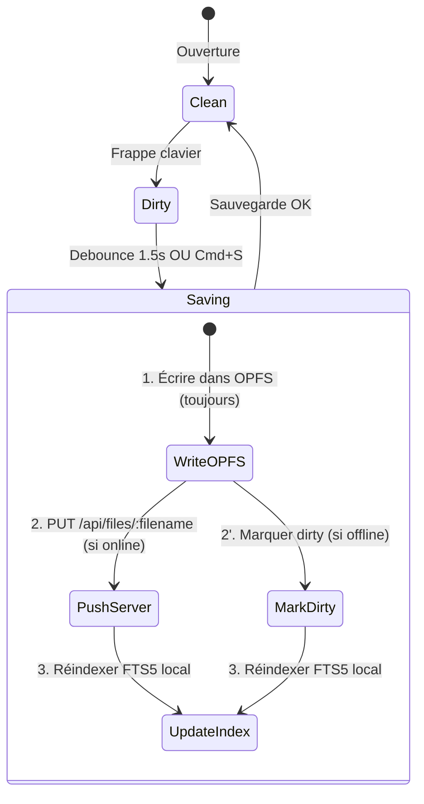

# Architecture Consolidée : Prise de Notes Markdown & Synchronisation DocSeeker

> [!IMPORTANT]
> **Principe fondateur** : Le **filesystem est la seule source de vérité**, tant côté serveur que côté client. Les bases SQLite (serveur et client) sont des **index/caches dérivés, jetables et reconstructibles** à tout moment.

---

## 1. Principes Directeurs

### 1.1. Filesystem-First (Serveur & Client)

```
                    SERVEUR                                    CLIENT
    ┌────────────────────────────┐          ┌────────────────────────────┐
    │   data/documents/          │          │   OPFS / IDB (fichiers)    │
    │   data/trash/              │          │   docseeker_pdfs/          │
    │   (fichiers physiques)     │          │   docseeker_md/            │
    │                            │          │                            │
    │   ═══ SOURCE DE VÉRITÉ ═══ │          │   ═══ SOURCE DE VÉRITÉ ═══ │
    └──────────┬─────────────────┘          └──────────┬─────────────────┘
               │ dérivable                             │ dérivable
               ▼                                       ▼
    ┌────────────────────────────┐          ┌────────────────────────────┐
    │   db.sqlite                │          │   SQLite-Wasm (OPFS)       │
    │   (index FTS5 + cache)     │          │   (index FTS5 + cache)     │
    │                            │          │                            │
    │   🗑️ JETABLE               │          │   🗑️ JETABLE               │
    │   rm db.sqlite → restart   │          │   repairDatabase() L4      │
    │   = tout revient           │          │   = tout revient           │
    └────────────────────────────┘          └────────────────────────────┘
```

### 1.2. Règles Absolues

1. **Titre = nom de fichier** : renommer le titre renomme le fichier physique (et inversement). Pas de métadonnée sidecar.
2. **`filename` = clé unique** : contrainte `UNIQUE(filename)` en DB, pas de doublon possible.
3. **`filename` = clé de synchronisation** : jamais les `id` SQLite (ils changent si la DB est reconstruite).
4. **Dossiers = répertoires physiques** : l'arborescence des folders est le reflet exact du filesystem.
5. **Suppression = soft-delete** : le fichier va dans `data/trash/` avec un JSON de métadonnées, récupérable 30 jours.
6. **La DB ne contient rien qu'on ne puisse recalculer** : texte extrait, hash, taille, index FTS5, arborescence — tout est dérivable des fichiers.

---

## 2. Arborescence Physique

### 2.1. Serveur

```
data/
├── documents/                              ← Source de vérité
│   ├── Cardiologie/                        ← Dossier = folder
│   │   ├── cours cardiologie.pdf           ← titre = "cours cardiologie"
│   │   └── notes sémiologie.md            ← titre = "notes sémiologie"
│   ├── assets/                             ← PJ des fichiers MD (ignoré par scanner)
│   │   └── notes sémiologie/              ← porte le nom du .md (sans extension)
│   │       ├── image1.png
│   │       └── schema_coeur.jpg
│   └── todo.md
│
├── trash/                                  ← Corbeille (30 jours)
│   ├── del_vieux cours.pdf                 ← fichier supprimé (préfixe del_)
│   ├── del_vieux cours.pdf.meta.json       ← métadonnées de suppression
│   ├── del_notes old.md
│   ├── del_notes old.md.meta.json
│   └── del_notes old/                      ← assets du fichier MD supprimé
│       └── image_old.png
│
├── cache_crops/                            ← Cache dérivé (jetable)
│   └── covers/
│       ├── 1.webp
│       └── 2.webp
│
└── db.sqlite                               ← Index dérivé (JETABLE)
```

### 2.2. Fichier `*.meta.json` de la Corbeille (le seul JSON nécessaire)

```json
{
  "original_path": "Cardiologie/vieux cours.pdf",
  "deleted_at": "2026-09-28T12:00:00Z",
  "expires_at": "2026-10-28T12:00:00Z"
}
```

> [!NOTE]
> C'est le seul fichier de métadonnées de tout le système. Il n'existe que dans `data/trash/` et porte les informations nécessaires à la restauration (chemin d'origine) et à la synchronisation (date de suppression pour LWW).

### 2.3. Client (OPFS / IDB)

```
OPFS (Origin Private File System)
├── docseeker_pdfs/                         ← PDFs cachés localement
│   ├── doc_cours cardiologie.pdf.pdf       ← clé = filename
│   └── doc_todo.md                         ← (pas de cache binaire pour les MD)
│
├── docseeker_md/                           ← Fichiers MD (contenu éditable)
│   ├── notes sémiologie.md                ← contenu Markdown brut
│   └── todo.md
│
├── docseeker_md_assets/                    ← Assets MD (images)
│   └── notes sémiologie/
│       └── image1.png
│
├── docseeker_trash/                        ← Miroir local de la corbeille
│   ├── del_vieux cours.pdf.meta.json
│   └── ...
│
└── docseeker_local.sqlite                  ← Index FTS5 local (JETABLE)

CacheStorage
├── docseeker_covers                        ← Vignettes WebP (jetable)
├── docseeker_offline_crops_v2              ← Crops de recherche (jetable)
└── docseeker-app-shell-v*                  ← HTML/CSS/JS/Wasm
```

---

## 3. Symétrie Serveur / Client — Pourquoi le Même Principe Fonctionne

### 3.1. Comparaison Structurelle

| Concept | Serveur | Client |
|:---|:---|:---|
| **Filesystem** | `data/documents/` (POSIX) | OPFS `docseeker_pdfs/` + `docseeker_md/` |
| **Corbeille** | `data/trash/` | OPFS `docseeker_trash/` |
| **Index/Cache** | `db.sqlite` (SQLite natif) | `docseeker_local.sqlite` (SQLite-Wasm OPFS) |
| **Couvertures** | `cache_crops/covers/*.webp` | CacheStorage `docseeker_covers` |
| **Reconstruction** | `reindex_all_library()` | [`repairDatabase()` L3-L4](file:///Users/francois/Documents/DocFastExplorer/frontend/offline-search-worker.js#L160-L193) + `_fullResyncAfterWorkerReset()` |
| **Clé primaire** | `filename` (UNIQUE) | `filename` |

### 3.2. Le Client Fait Déjà Ça !

L'architecture existante applique **déjà** ce principe sans le formaliser :

1. **[`PdfCacheManager`](file:///Users/francois/Documents/DocFastExplorer/frontend/pdf-cache.js)** stocke les PDFs dans OPFS comme des fichiers (`doc_{id}.pdf`) — c'est le filesystem client
2. **[`repairDatabase()`](file:///Users/francois/Documents/DocFastExplorer/frontend/offline-search-worker.js#L115-L193)** a 4 niveaux de reconstruction, jusqu'à la suppression totale de la DB + réouverture à neuf
3. **[`_fullResyncAfterWorkerReset()`](file:///Users/francois/Documents/DocFastExplorer/frontend/download-queue-manager.js#L143-L178)** reconstruit l'index local depuis le serveur + les PDFs en cache

> [!TIP]
> **La seule adaptation nécessaire** : passer de `doc_{id}.pdf` (clé par ID SQLite) à `doc_{filename}` (clé par filename) dans OPFS, puisque les IDs ne sont plus stables.

### 3.3. Reconstruction Côté Client — Deux Chemins



**En ligne** : la reconstruction est instantanée car le serveur fournit le texte déjà extrait (offline-bundle).

**Hors ligne** : la reconstruction est possible mais plus lente (il faut ré-extraire le texte de chaque PDF via PDF.js). Pour les Markdown, c'est instantané (le fichier brut EST le contenu indexable).

---

## 4. Modèle de Données

### 4.1. Schéma SQL (Index — Jetable)

Extension de [`search-core/src/schema.rs`](file:///Users/francois/Documents/DocFastExplorer/backend-rust/crates/search-core/src/schema.rs) :

```sql
-- Migration idempotente
ALTER TABLE documents ADD COLUMN doc_type TEXT DEFAULT 'pdf';
-- Valeurs : 'pdf', 'markdown', 'text'

ALTER TABLE documents ADD COLUMN deleted_at DATETIME;
-- Non-null quand le fichier est en corbeille (status = 'trashed')
```

> [!NOTE]
> Ces colonnes sont **reconstructibles** :
> - `doc_type` → déduit de l'extension du fichier
> - `deleted_at` → lu depuis le `*.meta.json` dans `data/trash/`

### 4.2. Assets Markdown

```
data/documents/assets/<nom_fichier_sans_ext>/
```

- Le dossier `assets/` est **invisible** dans l'explorateur (filtré dans le scanner)
- Les images collées dans l'éditeur Milkdown sont uploadées automatiquement
- Les liens Markdown pointent en relatif : ``
- Les assets suivent le fichier MD dans la corbeille et lors de la restauration

---

## 5. Synchronisation — Protocole Filesystem-to-Filesystem

### 5.1. Vue Globale

La synchronisation ne transfère plus des « rows SQL » mais des **fichiers**. Le protocole est un `rsync` logique :



### 5.2. Endpoint `POST /api/sync/manifest` — Algorithme Serveur

```
Pour chaque fichier client :
├── Fichier présent dans data/documents/ ?
│   ├── OUI : comparer mtime
│   │   ├── client.mtime > server.mtime → push (client gagne)
│   │   ├── server.mtime > client.mtime → pull (serveur gagne)
│   │   └── mtime égaux, hash ≠ → pull (serveur = source de vérité)
│   └── NON :
│       ├── Fichier dans data/trash/ ?
│       │   ├── OUI et client.mtime > trash.deleted_at → push (restauration implicite)
│       │   └── OUI et trash.deleted_at > client.mtime → delete_local
│       └── NON → push (nouveau fichier)

Pour chaque fichier serveur absent du client :
└── → pull (nouveau fichier pour ce client)
```

### 5.3. Endpoints API — Nouveau Catalogue

| Méthode | Route | Rôle |
|:---|:---|:---|
| `POST` | `/api/sync/manifest` | Synchronisation complète (remplace `sync/check`) |
| `GET` | `/api/files/:filename` | Lecture contenu brut (PDF binaire ou MD texte) |
| `PUT` | `/api/files/:filename` | Écriture fichier (sauvegarde MD ou upload PDF) |
| `POST` | `/api/files` | Création nouveau fichier (note MD) |
| `DELETE` | `/api/files/:filename` | Soft-delete → corbeille |
| `POST` | `/api/files/:filename/restore` | Restauration depuis corbeille |
| `GET` | `/api/trash` | Liste des fichiers en corbeille |
| `DELETE` | `/api/trash/:filename` | Purge définitive |
| `POST` | `/api/files/:filename/assets` | Upload asset (image MD) |
| `GET` | `/api/files/:filename/assets/:name` | Lecture asset |
| `POST` | `/api/rebuild-db` | Reconstruction totale de la DB (admin) |

> [!NOTE]
> Les endpoints existants (`/api/documents`, `/api/cover/`, `/api/search`, etc.) restent en place pour la rétrocompatibilité et les fonctionnalités de listing/recherche qui utilisent la DB comme cache.

### 5.4. Opérations Atomiques & Interruptibles

| Opération | Atomicité serveur | Atomicité client |
|:---|:---|:---|
| **Push fichier** | `write .tmp → rename` | `OPFS write → commit` |
| **Push asset** | Upload unitaire par fichier | OPFS write unitaire |
| **Pull fichier** | Lecture simple | OPFS write + update SQLite |
| **Delete** | `rename → trash/ + write .meta.json` | Supprimer de OPFS |
| **Restore** | `rename trash/ → documents/ + delete .meta.json` | Write OPFS + réindexer |

**Chaque opération est indépendante.** Interrompre la sync après 3 fichiers sur 10 = 3 fichiers cohérents + 7 à resynchroniser au prochain essai.

---

## 6. Reconstruction de la DB — Serveur

### 6.1. Algorithme `rebuild_database_from_filesystem()`

```rust
pub fn rebuild_database_from_filesystem(
    conn: &Connection, config: &Config
) -> Result<Vec<i64>, String> {
    // 1. RAZ totale
    conn.execute_batch("
        DELETE FROM pages;
        DELETE FROM documents;
        DELETE FROM folders;
        INSERT INTO pages_fts(pages_fts) VALUES('rebuild');
        INSERT INTO documents_fts(documents_fts) VALUES('rebuild');
    ")?;

    // 2. Scanner l'arborescence → recréer les folders
    //    (ignore: assets/, .meta.json, fichiers commençant par .)
    let folder_map = sync_folders_from_fs(conn, &config.documents_dir);

    // 3. Scanner tous les fichiers (PDF + MD + TXT)
    let all_files = collect_document_files_recursive(
        &config.documents_dir, &config.documents_dir
    ); // → exclut assets/ et fichiers cachés

    let mut queued = Vec::new();
    for (path, norm_fname) in all_files {
        let doc_type = detect_doc_type(&path);
        let title = derive_title_from_filename(&norm_fname);
        let (created, updated) = read_fs_timestamps(&path); // ctime/mtime
        let file_size = fs::metadata(&path)?.len() as i64;
        let folder_id = infer_folder_id(&norm_fname, &folder_map);

        conn.execute(
            "INSERT INTO documents (filename, title, file_size, folder_id,
             doc_type, status, created_at, updated_at)
             VALUES (?1, ?2, ?3, ?4, ?5, 'pending', ?6, ?7)",
            params![norm_fname, title, file_size, folder_id,
                    doc_type, created, updated],
        )?;
        queued.push(conn.last_insert_rowid());
    }

    // 4. Scanner la corbeille
    rebuild_trash_entries(conn, &config.data_dir.join("trash"))?;

    // 5. Purger les couvertures → regénération par la pipeline
    clean_directory(&config.covers_dir);

    Ok(queued)
    // → chaque ID est envoyé à IndexingPipeline.enqueue()
}
```

### 6.2. Ce Qui Est Perdu à la Reconstruction

**Rien d'irremplaçable.**

| Donnée | Reconstruction | Délai |
|:---|:---|:---|
| Catalogue documents | ✅ Instantané (scan FS) | < 1s |
| Arborescence dossiers | ✅ Instantané (scan FS) | < 1s |
| Titres | ✅ Dérivés du nom de fichier | < 1s |
| Hash SHA-256 | ✅ Recalculé (mais coûteux) | ~1s / 500Mo |
| Texte extrait + FTS5 | ✅ Réextraction Pdfium/MD | ~minutes (gros PDF) |
| Couvertures WebP | ✅ Regénérées par pipeline | Après indexation |
| Corbeille | ✅ Depuis les `.meta.json` | < 1s |
| Sessions auth | ❌ Perdues → re-login | Immédiat |

---

## 7. Reconstruction de l'Index — Client

### 7.1. Déjà Implémenté à 90%

Le client a déjà ce mécanisme via [`repairDatabase()`](file:///Users/francois/Documents/DocFastExplorer/frontend/offline-search-worker.js#L115-L193) (4 niveaux d'escalade) et [`_fullResyncAfterWorkerReset()`](file:///Users/francois/Documents/DocFastExplorer/frontend/download-queue-manager.js#L143-L178).

### 7.2. Deux Chemins de Reconstruction

**En ligne (rapide)** :
```javascript
async function rebuildLocalIndex() {
  // 1. Vider SQLite-Wasm
  db.exec(get_schema_sql()); // recréer tables vides

  // 2. Re-télécharger les métadonnées depuis le serveur
  const docs = await fetch('/api/documents').then(r => r.json());
  const folders = await fetch('/api/folders').then(r => r.json());
  await syncLibraryMeta(docs.documents, folders.folders);

  // 3. Pour chaque fichier en cache OPFS, re-télécharger l'offline-bundle
  const cachedFiles = await scanOPFS();
  for (const filename of cachedFiles) {
    const bundle = await fetch(`/api/documents/${filename}/offline-bundle`);
    await insertBundle(bundle); // INSERT pages + FTS5
  }
}
```

**Hors ligne (autonome)** :
```javascript
async function rebuildLocalIndexOffline() {
  // 1. Scanner les fichiers MD en OPFS → contenu directement indexable
  const mdFiles = await scanOPFS('docseeker_md');
  for (const {filename, content} of mdFiles) {
    const plainText = stripMarkdown(content);
    // INSERT INTO pages (doc_id, page_number, text_content) ...
    // → triggers FTS5 automatiques
  }

  // 2. Scanner les PDFs en OPFS → extraction via PDF.js (lent mais possible)
  const pdfFiles = await scanOPFS('docseeker_pdfs');
  for (const {filename, blob} of pdfFiles) {
    const pdf = await pdfjsLib.getDocument(blob).promise;
    for (let p = 1; p <= pdf.numPages; p++) {
      const page = await pdf.getPage(p);
      const textContent = await page.getTextContent();
      // INSERT INTO pages ...
    }
  }
}
```

### 7.3. Migration OPFS : Clé par `filename` au Lieu de `id`

```diff
 // Avant (pdf-cache.js)
-const fileName = `doc_${id}.pdf`;
+const fileName = `doc_${encodeFilename(filename)}`;

 // Fonction d'encodage sûre pour OPFS
+function encodeFilename(filename) {
+  // OPFS accepte la plupart des caractères sauf / et NUL
+  return filename.replace(/\//g, '⁄'); // remplacer / par fraction slash
+}
```

> [!WARNING]
> Ce changement impacte [`PdfCacheManager`](file:///Users/francois/Documents/DocFastExplorer/frontend/pdf-cache.js). Il faut prévoir une migration automatique : au premier lancement après mise à jour, scanner les `doc_{id}.pdf` existants, les re-nommer en `doc_{filename}` via la correspondance id→filename depuis la DB (encore disponible à ce moment).

---

## 8. Éditeur Markdown — Milkdown

### 8.1. Intégration

```
┌──────────────────────────────────────────┐
│  TabBar  [PDF 1] [Note MD] [PDF 2]  ... │
├──────────────────────────────────────────┤
│  ┌──────────────────────────────────┐    │
│  │  #pdfFrame (iframe)             │    │  ← si doc_type = 'pdf'
│  └──────────────────────────────────┘    │
│  ┌──────────────────────────────────┐    │
│  │  #markdownEditorContainer       │    │  ← si doc_type = 'markdown'
│  │  ┌────────────────────────────┐  │    │
│  │  │  Milkdown (ProseMirror)   │  │    │
│  │  │  WYSIWYG instantané       │  │    │
│  │  │  Slash commands (/)       │  │    │
│  │  │  Tables, KaTeX, code      │  │    │
│  │  └────────────────────────────┘  │    │
│  └──────────────────────────────────┘    │
└──────────────────────────────────────────┘
```

### 8.2. Auto-Save Offline-First



1. **Chaque sauvegarde écrit d'abord dans OPFS** → persistance garantie même en cas de crash
2. **Si online** : `PUT /api/files/:filename` → le serveur écrit le fichier + réindexe
3. **Si offline** : le fichier est marqué `dirty` dans un petit store IDB et sera pushé à la reconnexion
4. **L'index FTS5 local est mis à jour immédiatement** (< 1ms pour un MD)

### 8.3. Store `dirty_files` (IDB)

Un store minuscule pour traquer les fichiers modifiés offline :

```javascript
// IndexedDB store 'docseeker_dirty_files'
{
  filename: "notes sémiologie.md",   // clé primaire
  mtime: "2026-09-28T12:00:00Z",     // horodatage de la dernière modif locale
  type: "modified"                    // "modified" | "created" | "deleted"
}
```

Ce store est purgé au fur et à mesure que les fichiers sont synchronisés avec succès.

---

## 9. Corbeille — Soft-Delete Unifié

### 9.1. Suppression

```rust
pub fn soft_delete(config: &Config, filename: &str) -> Result<(), String> {
    let trash_dir = config.data_dir.join("trash");
    fs::create_dir_all(&trash_dir).ok();

    let trash_filename = format!("del_{}", filename);

    // 1. Déplacer le fichier physique
    let src = resolve_file_path(&config.documents_dir, filename)?;
    fs::rename(&src, trash_dir.join(&trash_filename))?;

    // 2. Déplacer les assets si MD
    if is_markdown(filename) {
        let stem = Path::new(filename).file_stem().unwrap();
        let assets_src = config.documents_dir.join("assets").join(stem);
        if assets_src.exists() {
            let assets_dst = trash_dir.join(format!("del_{}", stem.to_str().unwrap()));
            fs::rename(&assets_src, &assets_dst).ok();
        }
    }

    // 3. Écrire le .meta.json
    let meta = json!({
        "original_path": filename,
        "deleted_at": Utc::now().to_rfc3339(),
        "expires_at": (Utc::now() + Duration::days(30)).to_rfc3339()
    });
    fs::write(
        trash_dir.join(format!("{}.meta.json", trash_filename)),
        serde_json::to_string_pretty(&meta)?
    )?;

    // 4. Mettre à jour la DB (index, pas source de vérité)
    conn.execute(
        "UPDATE documents SET status = 'trashed', deleted_at = CURRENT_TIMESTAMP WHERE filename = ?1",
        params![filename],
    )?;
    conn.execute("DELETE FROM pages WHERE doc_id = (SELECT id FROM documents WHERE filename = ?1)", params![filename])?;

    Ok(())
}
```

### 9.2. Restauration

```rust
pub fn restore_from_trash(config: &Config, filename: &str) -> Result<(), String> {
    let trash_dir = config.data_dir.join("trash");
    let trash_filename = format!("del_{}", filename);

    // 1. Lire le .meta.json pour connaître le chemin d'origine
    let meta_path = trash_dir.join(format!("{}.meta.json", trash_filename));
    let meta: serde_json::Value = serde_json::from_str(
        &fs::read_to_string(&meta_path)?
    )?;
    let original_path = meta["original_path"].as_str().unwrap();

    // 2. Remettre le fichier à son emplacement d'origine
    let dest = config.documents_dir.join(original_path);
    fs::create_dir_all(dest.parent().unwrap()).ok();
    fs::rename(trash_dir.join(&trash_filename), &dest)?;

    // 3. Restaurer les assets si MD
    // ...

    // 4. Supprimer le .meta.json
    fs::remove_file(&meta_path).ok();

    // 5. Réindexer (pipeline)
    conn.execute(
        "UPDATE documents SET status = 'pending', deleted_at = NULL, 
         filename = ?1 WHERE filename = ?2",
        params![original_path, trash_filename],
    )?;

    Ok(())
}
```

### 9.3. Propagation Multi-Clients

```
Client A supprime "notes.md" → serveur met en trash (deleted_at = T1)
Client B se synchronise → SyncPlan contient delete_local("notes.md")
Client B supprime sa copie locale

Client C (offline) édite "notes.md" (mtime = T2, T2 > T1)
Client C se reconnecte → SyncPlan : push ("notes.md") car T2 > T1
→ Le fichier est restauré implicitement (la version vivante gagne)
```

---

## 10. Indexation

### 10.1. Trait `DocumentProcessor` (Backend)

```rust
pub trait DocumentProcessor: Send + Sync {
    fn doc_type(&self) -> &'static str;
    fn supported_extensions(&self) -> &[&str];
    fn extract_title(&self, filename: &str) -> String;
    fn extract_pages(&self, file_path: &Path) -> Result<Vec<ExtractedPage>, String>;
    fn generate_cover(&self, file_path: &Path, cover_path: &Path) -> Result<(), String>;
}
```

### 10.2. `MarkdownProcessor`

- **1 note = 1 page** (`page_number = 1`)
- Texte strippé du Markdown pour FTS5 (pas de `#`, `**`, `[]()` dans l'index)
- Pas de `words_json` (coordonnées spatiales inutiles pour le MD)
- Vignette : carte stylisée via `resvg` (badge `#MD`, titre, 6 premières lignes)

### 10.3. Quand Réindexer

| Événement | Indexation |
|:---|:---|
| Auto-save (MD) | FTS5 local immédiat + serveur après PUT |
| Sync pull | FTS5 local via worker |
| Sync push | Serveur : pipeline d'indexation |
| Restauration | Pipeline complète (texte + vignette) |
| Suppression | DELETE pages → triggers FTS5 automatiques |
| Reconstruction DB | Pipeline complète pour tout |

---

## 11. Cas Limites

### 11.1. Édition Simultanée sur 2 Clients

Le plus récent (`mtime`) gagne. Pas de merge, LWW pur.

### 11.2. Suppression Client A / Édition Client B

Si `client_B.mtime > trash.deleted_at` → le fichier est restauré (la vie gagne sur la mort).

### 11.3. Création Offline avec Même Nom

LWW sur `mtime`. Le plus récent écrase l'autre.

### 11.4. Interruption de Sync

Chaque opération étant unitaire, les fichiers déjà synchronisés sont cohérents. Les restants reprennent au prochain essai.

### 11.5. DB Corrompue Serveur

`rm db.sqlite` → au redémarrage, `rebuild_database_from_filesystem()` reconstruit tout automatiquement.

### 11.6. DB Corrompue Client

[`repairDatabase()`](file:///Users/francois/Documents/DocFastExplorer/frontend/offline-search-worker.js#L115-L193) escalade jusqu'à la suppression OPFS de la DB + recréation. Les fichiers en OPFS sont intacts.

---

## 12. Plan d'Implémentation

### Phase 1 — Backend : Filesystem-First
1. Migration schéma SQL (`doc_type`, `deleted_at`) dans [`schema.rs`](file:///Users/francois/Documents/DocFastExplorer/backend-rust/crates/search-core/src/schema.rs)
2. Module `document/` avec trait `DocumentProcessor` + `MarkdownProcessor`
3. `rebuild_database_from_filesystem()` (extension de `reindex_all_library`)
4. Corbeille (`soft_delete`, `restore`, `.meta.json`, purge CRON)
5. Endpoint `POST /api/sync/manifest` (SyncPlan unifié)
6. Endpoints fichiers : `GET/PUT /api/files/:filename`, `POST /api/files`
7. Scanner unifié `.pdf + .md + .txt` (remplace `collect_pdf_files_recursive`)

### Phase 2 — Frontend : Éditeur Milkdown
8. Intégration Milkdown dans [`app.js`](file:///Users/francois/Documents/DocFastExplorer/frontend/app.js) (conteneur + toggle PDF/MD)
9. Auto-save OPFS + serveur avec debounce
10. Upload/affichage des assets
11. Vignettes MD côté serveur (`resvg`)
12. Bouton "+ Nouvelle note" dans la sidebar

### Phase 3 — Synchronisation Offline
13. Migration OPFS : clé par `filename` au lieu de `id`
14. Store OPFS `docseeker_md/` pour les fichiers Markdown
15. Store IDB `docseeker_dirty_files` pour le suivi offline
16. `SyncManager` dans app.js
17. Reconstruction hors-ligne (PDF.js + MD direct)

### Phase 4 — Consolidation
18. UI corbeille dans l'explorateur
19. Unifier les scanners (`collect_document_files_recursive`)
20. Tests Playwright (sync, offline, corbeille, reconstruction DB)
21. CRON : purge trash 30j + vérification cohérence FS↔DB

---

## 13. Fichiers Impactés

| Fichier | Modification |
|:---|:---|
| [`search-core/src/schema.rs`](file:///Users/francois/Documents/DocFastExplorer/backend-rust/crates/search-core/src/schema.rs) | +`doc_type`, +`deleted_at` |
| [`db/mod.rs`](file:///Users/francois/Documents/DocFastExplorer/backend-rust/src/db/mod.rs) | `ensure_column` pour nouvelles colonnes |
| [`config.rs`](file:///Users/francois/Documents/DocFastExplorer/backend-rust/src/config.rs) | +`trash_dir` |
| [`routes/mod.rs`](file:///Users/francois/Documents/DocFastExplorer/backend-rust/src/routes/mod.rs) | Nouvelles routes `/api/files/*`, `/api/trash/*`, `/api/rebuild-db` |
| [`routes/documents.rs`](file:///Users/francois/Documents/DocFastExplorer/backend-rust/src/routes/documents.rs) | `delete` → soft-delete, +restore, +sync/manifest |
| [`pdf/indexer.rs`](file:///Users/francois/Documents/DocFastExplorer/backend-rust/src/pdf/indexer.rs) | Extraction communes → `document/indexer.rs`, scanner unifié |
| [`pipeline/mod.rs`](file:///Users/francois/Documents/DocFastExplorer/backend-rust/src/pipeline/mod.rs) | Dispatch PDF/MD dans `process_document` |
| **NOUVEAU** `document/` | Trait, MD processor, trash, sync, cover generator |
| [`sw.js`](file:///Users/francois/Documents/DocFastExplorer/frontend/sw.js) | Routes MD + assets |
| [`app.js`](file:///Users/francois/Documents/DocFastExplorer/frontend/app.js) | Éditeur Milkdown, SyncManager, UI corbeille |
| [`pdf-cache.js`](file:///Users/francois/Documents/DocFastExplorer/frontend/pdf-cache.js) | Migration clé `id` → `filename` |
| [`download-queue-manager.js`](file:///Users/francois/Documents/DocFastExplorer/frontend/download-queue-manager.js) | Support MD dans sync |
| [`offline-search-worker.js`](file:///Users/francois/Documents/DocFastExplorer/frontend/offline-search-worker.js) | Indexation MD, reconstruction offline |

---

## 14. Suivi d'Avancement des Tâches (Task Tracker)

> Ce tableau est tenu à jour en continu pour permettre la reprise immédiate par tout développeur.

### Phase 1 — Backend : Filesystem-First
- [x] **1.1 Migration schéma SQL** : colonnes `doc_type` (DEFAULT 'pdf'), `deleted_at`, index dans [`schema.rs`](file:///Users/francois/Documents/DocFastExplorer/backend-rust/crates/search-core/src/schema.rs) et migrations dans [`db/mod.rs`](file:///Users/francois/Documents/DocFastExplorer/backend-rust/src/db/mod.rs)
- [x] **1.2 Configuration** : ajout `trash_dir` et `max_md_upload_size` dans [`config.rs`](file:///Users/francois/Documents/DocFastExplorer/backend-rust/src/config.rs)
- [x] **1.3 Module `document/`** :
  - [x] `processor.rs` : Trait `DocumentProcessor`, structs `ExtractedPage`, `DocumentMetadata`
  - [x] `markdown.rs` : `MarkdownProcessor` (strip MD, carte vignette WebP)
  - [x] `trash.rs` : `soft_delete()`, `restore_from_trash()`, `list_trash()`, `purge_expired_trash()`, gestion `.meta.json` + `assets/`
- [x] **1.4 Reconstruction DB & Scanner Unifié** :
  - [x] Scanner multi-extensions (`.pdf`, `.md`, `.txt`) ignorant `assets/` et fichiers cachés
  - [x] `rebuild_database_from_filesystem()` intégrant PDF + Markdown + corbeille
  - [x] Intégration dans `pipeline/mod.rs` pour dispatcher selon le type de doc
  - [x] Scan et synchronisation unifiée au démarrage dans `main.rs`
- [x] **1.5 API Endpoints Filesystem & Sync** :
  - [x] `GET /api/files/*filename` : lecture brute (binaire ou texte)
  - [x] `PUT /api/files/*filename` : écriture/sauvegarde atomique (crée dossier si besoin, déclenche indexation)
  - [x] `POST /api/files` : création nouvelle note Markdown
  - [x] `POST /api/assets/:stem` : upload pièce jointe dans `assets/<stem>/`
  - [x] `GET /api/assets/:stem/:name` : streaming asset
  - [x] `DELETE /api/files/*filename` : soft-delete vers corbeille
  - [x] `POST /api/trash/restore` & `POST /api/trash/*filename` : restauration depuis corbeille
  - [x] `GET /api/trash` & `DELETE /api/trash/*filename` (purge unitaire)
  - [x] `POST /api/sync/manifest` : synchronisation différentielle LWW client ↔ serveur
  - [x] `POST /api/rebuild-db` : endpoint de reconstruction totale DB
- [x] **1.6 Tests automatiques API Backend** (tests d'intégration Cargo test : `tests/files_and_trash_tests.rs`)

### Phase 2 — Frontend : Éditeur Milkdown & Notes Markdown
- [x] **2.1 Intégration Milkdown WYSIWYG** (bundle autonome vendor `milkdown.js` + `milkdown.css`, support titres, listes, citations, raccourcis)
- [x] **2.2 Auto-save offline-first** (OPFS immédiat, debounce 1.5s serveur `PUT /api/files/:filename`, store `docseeker_dirty_files` si offline)
- [x] **2.3 Gestion des Assets / Pièces jointes** (paste image, drag-and-drop, upload `/api/assets/:stem`, liens Markdown relatifs ``)
- [x] **2.4 Bouton "+ Nouvelle note" & UX Explorateur** (bouton toolbar `#newMarkdownNoteBtn`, badge `.doc-card-badge-md`, icônes MD dans l'explorateur)

### Phase 3 — Synchronisation Offline Client
- [x] **3.1 Migration OPFS** : clé par `filename` (encodage safe avec fraction-slash `⁄` pour préserver l'arborescence)
- [x] **3.2 Stores OPFS & IDB** : répertoire OPFS `docseeker_md/`, IndexedDB `docseeker_sync_db` store `dirty_files`
- [x] **3.3 `SyncManager`** : implémentation client du protocole manifest SyncPlan (`POST /api/sync/manifest`, LWW mtime) avec auto-sync au boot et reconnexion (`online`)
- [x] **3.4 Reconstruction index client** (`offline-search-worker.js` message `INDEX_MARKDOWN_DOC` avec extraction `stripMarkdown()` et indexation FTS5 locale instantanée)

### Phase 4 — Consolidation & Tests E2E
- [x] **4.1 UI Corbeille** dans l'explorateur (vue `#viewTrash`, onglet `#navBtnTrash` avec badge dynamique, cartes de corbeille, restauration unitaire et vidage global)
- [x] **4.2 Tâche de fond CRON** (purge auto des corbeilles > 30 jours au boot serveur via `purge_expired_trash` dans `main.rs`)
- [x] **4.3 Tests Playwright E2E** (`tests/ui/ui_markdown_and_trash.spec.mjs` : 4 tests UI / E2E validés à 100% en 7.3s, 52 tests backend Rust validés à 100%)


